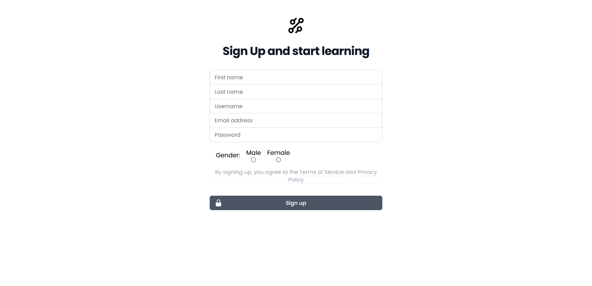
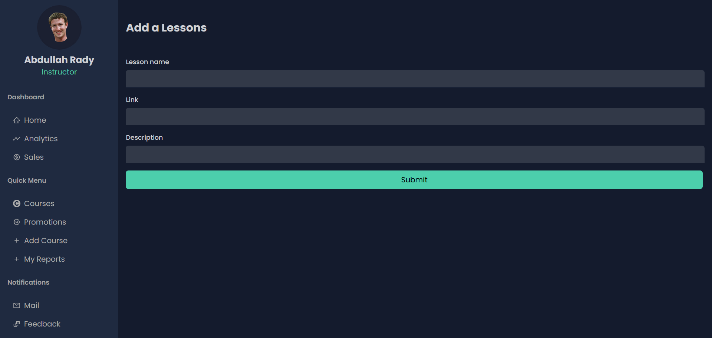

<a name="readme-top"></a>

# Bug-Squash-Gang

# Advanced Computer Lab Project
> This website is an online learning and teaching marketplace. The application is built using the `MERN` stack.

<!-- TABLE OF CONTENTS -->
<details>
  <summary>Table of Contents</summary>
  <ol>
    <li>
      <a href="#Motivation">Motivation</a>
    </li>
    <li><a href="#technologies-used">Build Status</a></li>
    <li><a href="#Motivation">Code Style</a></li>
    <li><a href="#screenshots">Screenshots</a></li>
    <li><a href="#project-status">Tech/Framework used</a></li>
    <li><a href="#room-for-improvement">Features</a></li>
    <li><a href="#room-for-improvement">Code Examples</a></li>
    <li><a href="#room-for-improvement">Installation</a></li>
    <li><a href="#room-for-improvement">API Reference </a></li>
    <li><a href="#room-for-improvement">Tests</a></li>
    <li><a href="#room-for-improvement"> How to use</a></li>
    <li><a href="#room-for-improvement">Contribution</a></li>
    <li><a href="#room-for-improvement">Credits</a></li>

  </ol>
</details>


<p align="right">(<a href="#readme-top">back to top</a>)</p>


## Motivation :100:
This is a projected created for the GUC `CSEN704 Advanced Computer lab` it teaches students : 

-  It allows the creation of a 3-tier architecture that includes frontend, backend, and database using JavaScript and JSON.
-  MERN stack which is a collection of technologies that enables faster application development. 
-  Software development process
-  Software Testing
-  Web development

<p align="right">(<a href="#readme-top">back to top</a>)</p>


## Build Status :hammer_and_wrench:
- This is a project which is still in development.
- Need implementation of stripe software for proper credit card implementation.
- Some issues with routes for course search with filters.
- Refresh needed after logging in.
- Need some maintaince for enrolling and buying courses where button still appears to buy/enroll even if you already have access to it.
- Users can rate courses without logging in or finishing the course.
- A message broker needs to be added to the application to handle asynchronous tasks such as sending emails and notifications.
- Some UX maintainance


<p align="right">(<a href="#readme-top">back to top</a>)</p>


## Code Style :memo: 
The code style is made by using 'tailwind css' and 'postcss'. The code style is enforced using `pre-commit` hooks and `pre-commit github action.`

<p align="right">(<a href="#readme-top">back to top</a>)</p>


## Screenshots
<details>
<summary>Home Page</summary>
  
</details>

<details>
<summary>Signin Page</summary>
  
</details>

<details>
<summary>Signup Page </summary>
  

</details>

<details>
<summary>Creating new users </summary>
  

</details>

<details>
<summary>Promo Code Creation </summary>
  

</details>

<details>
<summary>Reports </summary>
  

</details>
<details>
<summary>Resolving Reports </summary>
  

</details>

<details>
<summary>Instructor's Courses </summary>
  

</details>


<details>
<summary>Adding a Course </summary>
  

</details>


<details>
<summary>Adding an Exam </summary>
  

</details>


<details>
<summary>Adding Lessons </summary>
  

</details>


<details>
<summary>Reporting a Problem </summary>
  

</details>


<details>
<summary>Viewing all Courses </summary>
  

</details>


<details>
<summary>Viewing A Course </summary>
  

</details>


<details>
<summary>Viewing Instructor's Profile </summary>
  

</details>

<details>
<summary>Student's Courses </summary>
  

</details>

<details>
<summary>Watching Lessons </summary>
  

</details>

<details>
<summary>Student's Reports </summary>
  

</details>

 <details>
<summary>Buying A Course </summary>
  

</details>

<details>
<summary>Country Selection </summary>
  

</details>


<p align="right">(<a href="#readme-top">back to top</a>)</p>


## Tech/Framework used :sparkle:


* [![Express][Express.js]][Express-url]
* [![React][React.js]][React-url]
* [![Mongo][Mongo.js]][Mongo-url]
* [![NodeJs][Node.io]][Node-url]
* [![GitHub][GitHub.io]][GitHub-url]
- [Mongoose](https://mongoosejs.com/)
-   [Vite](https://vitejs.dev/)
-   [Git](https://git-scm.com/)
-   [Github Actions](github.com/features/actions)
-   [Postman](https://www.postman.com/)
-   [VSCode](https://code.visualstudio.com/)


## Features  :dizzy:
This website can be accessed by admins, instructors, corporate or individual trainees where each of them has different functions to access across the website. First you need to put in your credentials in the sign in page or you can sign up if you are a new indivdual trainee.

### An Admin can :

-Create a profile for instructors or trainees.
-Create promotion codes for any course with specific discount.
-See requests by corporate trainees for a course where they either accept or decline.
-See reports of problems made by either students or instructors and can resolve them.

### An Instructor can :
-View the courses they teach.
-Add exam for students. 
-Add lessons with video links or report a problem.
-Add a new course. 
-View their own reports and their status.

### A Corporate\Indivdiual Trainee can :
-Search for courses with different filters.
-Request access for the desired course(buy course in case of individual trainee).
-Rate the course. 
-Rate the instructors and view their profile. 
-View courses they’re enrolled in. 
-Report a problem and view their reports.

### A Guest can : 
- Sign up as individual trainee 
- Search and filter courses


<p align="right">(<a href="#readme-top">back to top</a>)</p>


## Code Examples :clipboard:


```typescript
import React from "react";
import { BsStar } from "react-icons/bs";
import { BsStarHalf } from "react-icons/bs";
import { BsStarFill } from "react-icons/bs";

const Rating = ({ data }) => {

  let rating = data.rating;
  let filled = Math.round(rating);
  let halfStar = undefined;
  let is = 0;

  if (filled < rating) {
    halfStar = 1;
    is = 1;
  }

  if (!filled) {
    filled = 0
  }
  return (
    <div className="flex flex-row text-[12px] text-yellow-500 font-light items-center">
      {filled !== 0 && [...Array(filled)].map((e, i) => {
        return <BsStarFill key={i} />;
      })}
      {halfStar && <BsStarHalf />}
      {[...Array(5 - filled - is)].map((e, i) => {
        return <BsStar key={i} />;
      })}

      {data.number && <p className="ml-1 text-gray-500">({data.number})</p>}
    </div>
  );
};
```


```typescript
import React, { useEffect } from "react";
import { useState } from "react";
import { listCourses } from "../apis/courses-api";
import CourseVertical from "../components/CourseVertical";
import { Link } from "react-router-dom";
import Nav from "../components/Nav"

const Courses = () => {
  const [courses, setCourses] = useState();

  useEffect(() => {
    const fetchData = async () => {
      const result = await listCourses();
      console.log(result.data[0].price["$numberDecimal"]);
      setCourses(result.data);
    };

    fetchData();
    return () => {
      console.log("");
    };
  }, []);

  return (
    <>
      <Nav/>
    <div className="flex flex-row justify-center w-full">
      <div className="w-8/12 mt-12">
        <h1 className="font-bold text-2xl mb-6"> All Courses</h1>

      {
        !courses && 
        <div role="status">
            <svg aria-hidden="true" class="mr-2 w-8 h-8 text-gray-200 animate-spin dark:text-gray-600 fill-blue-600" viewBox="0 0 100 101" fill="none" xmlns="http://www.w3.org/2000/svg">
                <path d="M100 50.5908C100 78.2051 77.6142 100.591 50 100.591C22.3858 100.591 0 78.2051 0 50.5908C0 22.9766 22.3858 0.59082 50 0.59082C77.6142 0.59082 100 22.9766 100 50.5908ZM9.08144 50.5908C9.08144 73.1895 27.4013 91.5094 50 91.5094C72.5987 91.5094 90.9186 73.1895 90.9186 50.5908C90.9186 27.9921 72.5987 9.67226 50 9.67226C27.4013 9.67226 9.08144 27.9921 9.08144 50.5908Z" fill="currentColor"/>
                <path d="M93.9676 39.0409C96.393 38.4038 97.8624 35.9116 97.0079 33.5539C95.2932 28.8227 92.871 24.3692 89.8167 20.348C85.8452 15.1192 80.8826 10.7238 75.2124 7.41289C69.5422 4.10194 63.2754 1.94025 56.7698 1.05124C51.7666 0.367541 46.6976 0.446843 41.7345 1.27873C39.2613 1.69328 37.813 4.19778 38.4501 6.62326C39.0873 9.04874 41.5694 10.4717 44.0505 10.1071C47.8511 9.54855 51.7191 9.52689 55.5402 10.0491C60.8642 10.7766 65.9928 12.5457 70.6331 15.2552C75.2735 17.9648 79.3347 21.5619 82.5849 25.841C84.9175 28.9121 86.7997 32.2913 88.1811 35.8758C89.083 38.2158 91.5421 39.6781 93.9676 39.0409Z" fill="currentFill"/>
            </svg>
            <span class="sr-only">Loading...</span>
        </div>
      }
      {courses?.map((course, i) => {
        return (
          <Link to={`/course/${course._id}`} key={i}>
            <CourseVertical course={course} />
          </Link>
        );
      })}
      
      </div>
    </div>
      </>
  );
};
```

```typescript
const Admin = require('../models/users/admin.model');

const create = async (user) => {
    
    const admin = new Admin({_userid: user._id})

    user.role = "Admin"
    try {
        const id = admin._id

        await admin.save()

        return id
    } catch (error) {
        throw new Error(error)
    }
}

const list = async (req, res) => {
    try {
        let admins = await Admin.find().populate()
        return res.json(admins)
    } catch (error) {
        return res.status(400).json({
            error: error
        })
    }
}

const check = (req, res) => {
    if(req.auth.role === "Admin")
        return res.status(200).json({
            msg: "Admin"
        })

        return res.status(400).json({
            msg: "Not authorized"
        })
}
```

```typescript
const mongoose = require('mongoose');

const InstructorSchema =  new mongoose.Schema({
    _userid:{
        type : mongoose.ObjectId,
        ref: "User"
    },
    
    courses:{
        type : [mongoose.ObjectId],
        ref: "Course"
    },
    rating: {
        type: Number,
        default: 0
    },
    numberOfRatings: {
        type: Number,
        default: 0
    }
})
```

```typescript
const express = require('express');
const authCtrl = require('../controllers/auth.controller');
const userCtrl = require('../controllers/user.controller');
const corporateCntrl = require('../controllers/corporateTrainee.controller');
const router = express.Router()


router.route('/api/corporates')
    .post(authCtrl.requireSignin, authCtrl.isAdmin, userCtrl.create(corporateCntrl.create))

router.route('/api/corporates/request')
    .post(corporateCntrl.request)

router.route('/api/corporates/enroll')
    .post(corporateCntrl.enrollCourse)

    router.route('/api/corporates/reject')
    .post(corporateCntrl.reject)

router.route('/api/requests')
    .get(corporateCntrl.getAllRequests)

router.route('/api/corporates/:id')
    .get(corporateCntrl.getCorporateCourses)
```


```typescript
import { BrowserRouter } from "react-router-dom";
import MainRouter from "./MainRouter";
import axios from "axios";
import useLocalStorage from "./hooks/useLocalStorage";
import { useEffect } from "react";

const getLocation = async (store) => {
  if (store.get("country_name")) return;

  try {
    let res = await axios.get("https://geolocation-db.com/json/");

    console.log(res.data);
    store.set("country_name", res.data.country_name);
    store.set("country_code", res.data.country_code);
  } catch (error) {
    console.log(error);
  }
};

const getCurrency = () => {};

function App() {

  const local = useLocalStorage();

  useEffect(() => {
    getLocation(local);
    
    return () => {};
  }, []);
  
  return (
    <BrowserRouter>
      <MainRouter />
    </BrowserRouter>
  );
}
```

<p align="right">(<a href="#readme-top">back to top</a>)</p>


### Installation 📥

How does one go about using it?
1) Download the project.
2) Open a terminal tab in server and client folder then run

`npm i`
`npm run dev`


<p align="right">(<a href="#readme-top">back to top</a>)</p>


## API Reference 🧐

1-adminSignin
 
 - Route `/api/admins`
 - Request Type `POST`

2-Checking signin
 - Route `/api/admins/check`
 - Request Type `GET`

3-Authentication
 - Route `/auth/signin`
 - Request Type `Post`
 - Route `/auth/signout`
 - Request Type `Get`
 - Route `/auth/requestPasswordReset`
 - Request Type `Post`
 - Route `/auth/PasswordReset`
 - Request Type `Post`

4-Corporate Trainees
 - Route `/api/corporates`
 - Request Type `Post`
 - Route `/api/corporates/request`
 - Request Type `POST`
 - Route `/api/corporates/enroll`
 - Request Type `Post`
 - Route `/api/corporates/reject'
 - Request Type `Post`
 - Route `/api/requests`
 - Request Type `GET`
 - Route `/api/corporates/:id`
 - Request Type `GET`

5-Courses
 - Route `/api/courses`
 - Request Type `Post`
 - Route `/api/courses`
 - Request Type `GET`
 - Route `/api/courses/:id`
 - Request Type `GET`
 - Route `/api/courses/:id/addlesson'
 - Request Type `Post`
 - Route `/api/courses/:id/addexam`
 - Request Type `POST`
 - Route `/api/courses/:id/rate`
 - Request Type `POST`
 - Route `/api/courses/ByFilter`
 - Request Type `GET`
 - Route `/api/courses/ByPrice`
 - Request Type `POST`
 - Route `/api/courses/search`
 - Request Type `POST`

6-Individual Trainee
 - Route `/api/individual`
 - Request Type `POST`
 - Route `/api/individual/enroll'
 - Request Type `Post`
 - Route `/api/individual/:id'
 - Request Type `GET`

7-Instructor 
 - Route `/api/instructor`
 - Request Type `POST`
 - Route `/api/instructor/:id'
 - Request Type `GET`
 - Route `/api/instructor/:id/rate`
 - Request Type `POST`
 
 8-Password Reset
 - Route `services/requestPasswordReset`
 - Request Type `POST`

9-Promo
 - Route `/api/promo`
 - Request Type `POST`
 - Route `/api/usepromo`
 - Request Type `POST`

10-Reports
 - Route `/api/reports`
 - Request Type `GET`
 - Route `/api/reports/seen/:id`
 - Request Type `GET`
 - Route `/api/reports/user/:id`
 - Request Type `GEt`
 - Route `/api/reports/resolve/:id`
 - Request Type `GET`
 - Route `/api/reports`
 - Request Type `POST`

11-User 
 - Route `/api/users`
 - Request Type `GET` 
 - Route `/api/users/finish/:id`
 - Request Type `GET`
 - Route `/api/users/:userId`
 - Request Type `PATCH`
 - Route `/api/users/:userId`
 - Request Type `GET`


## Login credentials for testing purposes / Tests :1234:

The testing is done using PostMan.


Type | Email | Password
--- | --- | --- | --- |--- |--- |--- |--- |--- |--- |--- |---
Admin | abdosam@live.co.uk | asdasd123 
--- | --- | --- | --- |--- |--- |--- |--- |--- |--- |--- |---
Instructor | abdosam1@live.co.uk | asdasd123 
--- | --- | --- | --- |--- |--- |--- |--- |--- |--- |--- |---
Corporate Trainee | omar@gmail.com | asdasd123 

to test for a trainee just sign up and create a new account

<p align="right">(<a href="#readme-top">back to top</a>)</p>


## How to use :white_check_mark:

To run backend 
```bash
cd server && nodemon src/start.ts
```
To run frontend
```bash
cd client && npm start
```
the backend server and client will be running on the specified ports on your env files.
<p align="right">(<a href="#readme-top">back to top</a>)</p>


## Contribution :muscle:

- Abdelrahman Mohamed  
- Abdallah Sameh
- Omar Wael
- Sami Ali
- Ahmed Mohamed


## Credits :copyright:

- [Clean code](https://www.oreilly.com/library/view/clean-code-a/9780136083238/)
- [RESTful Web API Patterns and Practices Cookbook](https://learning.oreilly.com/library/view/restful-web-api/9781098106737/)
- [Designing Data Intensive Applications](https://www.oreilly.com/library/view/designing-data-intensive-applications/9781491903063/)
- [Mongoose docs](https://mongoosejs.com/docs/)
- [Express docs](https://expressjs.com/en/4x/api.html)
- [ReactJs docs](https://reactjs.org/docs/getting-started.html)
- [Redux docs](https://redux.js.org/api/api-reference)
- [NodeJs docs](https://nodejs.org/en/docs/)
-  [](https://opensource.org/licenses/Apache-2.0)
<p align="right">(<a href="#readme-top">back to top</a>)</p>


[Express.js]: https://img.shields.io/badge/express-4A4A55?style=for-the-badge&logo=express&logoColor=FFFFFF
[Express-url]: https://expressjs.com/
[React.js]: https://img.shields.io/badge/React-20232A?style=for-the-badge&logo=react&logoColor=61DAFB
[React-url]: https://reactjs.org/
[Mongo.js]: https://img.shields.io/badge/mongo%20DB-4A4A55?style=for-the-badge&logo=mongodb&logoColor=%2049da01
[Mongo-url]: https://vuejs.org/
[Node.io]: https://img.shields.io/badge/node.js-6DA55F?style=for-the-badge&logo=node.js&logoColor=white
[Node-url]: https://nodejs.org/en/
[GitHub.io]: https://img.shields.io/badge/github-%23121011.svg?style=for-the-badge&logo=github&logoColor=white
[GitHub-url]: https://github.com/

